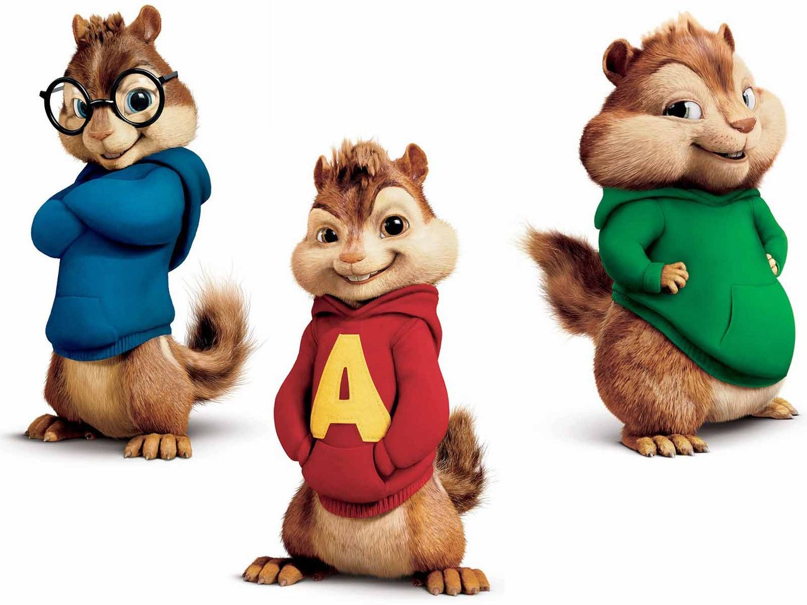
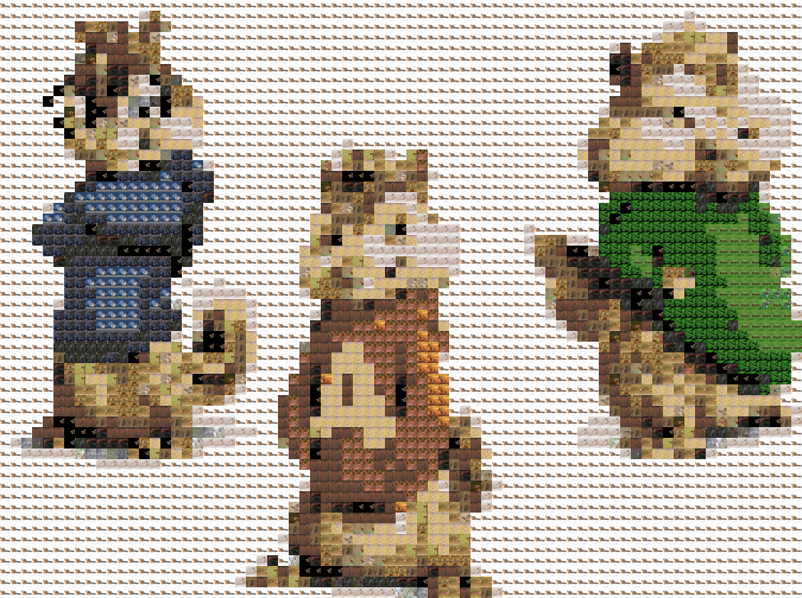

# Picture mosaic generator

Generate picture mosaics of pictures with pictures.

## Usage:

```bash
USAGE: ./Collage -i [path_to_image] -d [path_to_tile_directory] -t [amount_of_tiles] -c [amount_of_tile_files] -o [output_name]
  [path_to_image]:          path to the (jpg) image you want to create a collage for
  [path_to_tile_directory]: path to the directory that holds all the images that can be used as tiles for the collage
  [amount_of_tiles]:        the amount of tiles the program will **try** to fit in, this will vary depending on the input image
  [amount_of_tile_files]:   the amount of files the program should try from the tile_directory; note that all the files should be numbered incrementally
  [output_name]:            the name you want to give to your output file; if left blank output.jpg will be used
```

## Example usage and output:

```bash
$ ./Collage -i examples/alvinandchipmunks.jpg -d images/ -t 5000 -c 1862 -o chipmunks_collage.jpg
Creating collage for file: examples/alvinandchipmunks.jpg - With (pixel) dimensions of: 1280 x 960
Dimensions (pixels) of a tile: 15 x 15
Dimensions of tiles we will fit in: 85 x 64. A total of: 5440
Progress: [██                  ] 6.55%
```

## Examples

Original image:


Mosaic (of course, a mosaic of only chipmunk images...):



## License

[MIT License](./LICENSE.md)
